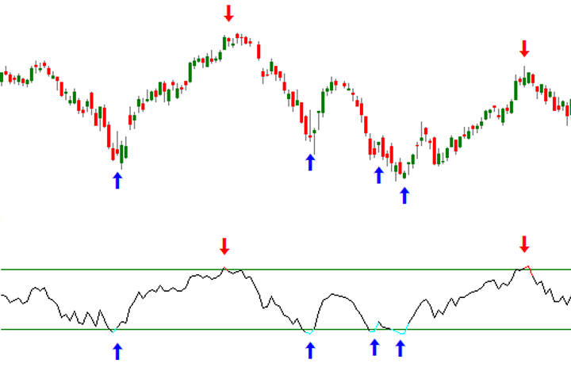

# Trading Strategies - Image Classification

This repository contains all the files of the stock prediction project, related to my Machine Learning class.


# Table of Contents
- [Overview](#overview)
- [Introduction](#introduction)
- [Trading Strategies](#trading-strategies)
  - [1. Bollinger Bands](#1-bollinger-bands)
  - [2. Relative Strength Index](#2-relative-strength-index)
- [Methodology](#methodology)
  - [1. Image Generation](#1image-generation)
    - [Data Collection](#data-collection)
    - [Data Preparation](#data-preparation)
    - [Signal Generation](#signal-generation)
      - [Buy vs Sell](#buy-vs-sell)
      - [Buy vs Sell/Hold](#buy-vs-sellhold)
  - [2. Feature Engineering](#2feature-engineering)
    - [Convolution](#convolution)
    - [Max Pooling](#max-pooling)
  - [3. Modeling](#3modeling)
    - [Train & Validation Split](#train--validation-split)
    - [Model Architecture](#model-architecture)    
    - [Model Selection](#performance-metrics)
- [Conclusion](#conclusion)
  
## Overview
Trading decisions have always been subjective i.e., there is `no definitive answer` for a decision when a `trader buys/sells/holds` a stock. This means that the subject-matter experts are in high demand, and we need to `invest in automation` to minimize human intervention. So let us explore the feasibility of building a new system that can `replicate the way humans trade`.

## Introduction
We will be analyzing the S&P 500 Global index data from `03-Jan-1983` till `18-Jun-2021`.We will use this data and `generate images and labels (buy/sell/hold)` using some popular trading strategies. Then we use these `images and train the model` to classify the images and `compare that with the labels` that we have generated for performance evaluation.

## Trading Strategies
### 1. Bollinger Bands
Bollinger Bands are widely used among traders. The indicator comprises an `upper band`, `lower band` and `moving average line`. The two trading bands are placed `two standard deviations` above and below the moving average (usually 20 periods) line. We use two standard deviations to capture a confidence interval of 95%. In the below image, we will make a `sell` decision when the `actual closing index crosses` the `upper band` and a `buy` decision when `actual closing index falls below` the `lower band`.


### 2. Relative strength index
The relative strength index (RSI) is a momentum indicator that measures the magnitude of recent price changes to evaluate `overbought` or `oversold` conditions in the price of a stock or other asset. The RSI is calculated using the formula `[100 - 100/(1+RS)]` where `RS` is the ratio of the Exponential Moving Average (window = 14) of all positive changes to the negative ones. An asset/stock is usually considered `overbought` => `ready to sell` when the RSI is `above 70%`and `oversold` => `ready to buy` when it is `below 30%`. In the below image, we `sell` at `red` arrows and `buy` at the `blue` ones.



## Methodology
Now that we have understood about the trading strategies, let us apply these to the `S&P 500 Global index data`. Below are the steps I have preformed to achieve this.

### 1.Image Generation
We have pulled the required data from `yahoo finance`. This provides information about the daily `open`,`close`,`high` and `low` values for the S&P 500 index. But, our `goal` is to `mimic the human decision`; and traders look at the trend graph and make a decision by using their quantitative finance knowledge. So we now generate images using the tabular data.

#### Data Collection
I have used `yahoo finance` API to get the data. Below is the code I have used to pull the data. You can change the `ticker`, `start` and `end` dates to get data for different stocks.
```python
import fix_yahoo_finance as yf
 
# Pull data from yahoo
ticker = '^GSPC'
df = yf.download(ticker, start='1983-01-01', end='2021-06-20')
```
#### Data Preparation
Below is the data structure of our tabular data. We use the `Close` value of each day for our whole analysis. Now we apply the `Bollinger Bands & RSI` strategies to the Close value and calculate the `Moving Average (SMA)`, `Bands (UB & LB)` and `RSI (RSI) index` for each day.

| Date     | Open    | High    | Low     | Close   | Adj Close | Volume     |
|----------|---------|---------|---------|---------|-----------|------------|
| 14-06-21 | 4248.31 | 4255.59 | 4234.07 | 4255.15 | 4255.15   | 3612050000 |
| 15-06-21 | 4255.28 | 4257.16 | 4238.35 | 4246.59 | 4246.59   | 3578450000 |
| 16-06-21 | 4248.87 | 4251.89 | 4202.45 | 4223.7  | 4223.7    | 3722050000 |
| 17-06-21 | 4220.37 | 4232.29 | 4196.05 | 4221.86 | 4221.86   | 3952110000 |

#### Signal Generation
Based on the values of the above table, we generate signal indicators for each day. Below is the data after the signal generation. `1 --> Buy`, `-1 --> Sell` and `0 --> Hold`

|   Date   |  Close  |   SMA   |    UB   |    LB   |  RSI  | BB Signal | RSI Signal |
|:--------:|:-------:|:-------:|:-------:|:-------:|:-----:|:---------:|:----------:|
| 06-05-21 | 4201.62 | 4167.12 | 4219.78 | 4114.46 | 61.75 |     0     |      0     |
| 07-05-21 | 4232.60 | 4172.31 | 4229.34 | 4115.28 | 68.70 |     -1    |      0     |
| 10-05-21 | 4188.43 | 4175.33 | 4228.77 | 4121.89 | 52.89 |     0     |      0     |
| 11-05-21 | 4152.10 | 4175.86 | 4228.09 | 4123.62 | 43.41 |     0     |      0     |
| 12-05-21 | 4063.04 | 4172.78 | 4242.17 | 4103.38 | 28.81 |     1     |      1     |

##### Buy vs Sell

##### Buy vs Sell/Hold

### 2.Feature Engineering

#### Convolution

#### Max Pooling

#### Model Architecture

### 3.Modeling

#### Train & Validation Split

#### Performance Metrics 

## Conclusion


